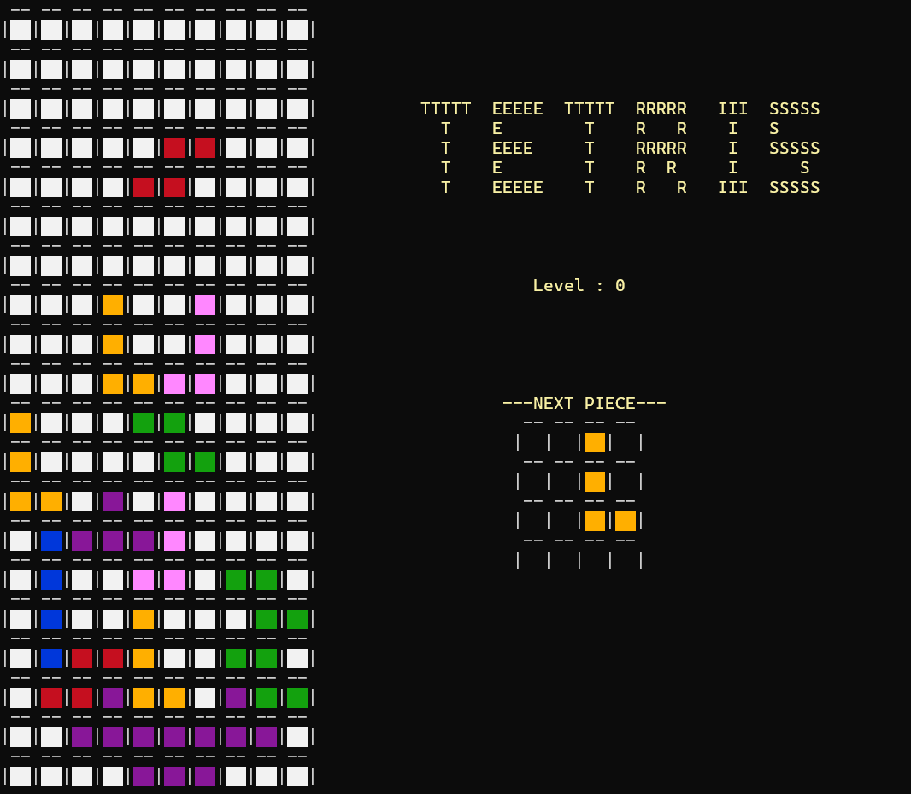

# Tetris Game

## Tetris Game - C++ Project Documentation

### ⚠This game is made for Windows

### Group: TechOut
1. 202401492 - Nisarg Vekariya  
2. 202404004 - Aum Bavarva  
3. 202404032 - Aditya Rangani  
4. 202401496 - Khush Vaghela  

## 📌 Introduction  
The Tetris Game is a classic puzzle game where players arrange falling tetramino pieces to form complete horizontal lines, which are then cleared to earn points. This C++ implementation features smooth console-based rendering, real-time input handling, dynamic level progression, and a colorful interface.

---

## 🎮 Features  
- Runs smoothly on *Windows* terminals. (It cannot run on iOS due to reliance on Windows-specific libraries like <windows.h>.)  
- *Smooth Rendering*: Uses SetConsoleCursorPosition() for flicker-free updates by directly manipulating the console cursor.  
- *Dynamic Difficulty*: Levels increase as lines are cleared, speeding up the tetramino drop rate.  
- *Score Tracking*: Points awarded for clearing lines (100 points per line).  
- *Colorful Interface*: ANSI color codes for vibrant tetramino visuals.  
- *Next Piece Preview*: Displays the upcoming tetramino for strategic planning.  
- *Game Over Detection*: Ends when a new tetramino cannot spawn without overlapping existing blocks.  

---

## 🛠 Class Descriptions  
### 🟥 Block Class (Block)  
Represents individual grid squares with color properties.  
#### Attributes:  
```string colour; // Stores the block's color (e.g., GRAY, PURPLE)```

#### Methods:
```
void display(); // Outputs the block with its color

void set_colour(string); // Updates the block's color

string get_colour(); // Returns the current color
```

### 🧩 Tetramino Class (Tetramino)  
Manages tetramino shapes, movement, rotation, and collision detection.  
#### Attributes:  
```
int tetramino; // Index of the tetramino type (0-6)

pair<int, int> pivot; // Starting position of the tetramino

vector<pair<int, int>> coordinates; // Current block positions
```

#### Methods:  
```
bool game_over(...); // Checks if the game is over

void form(...); // Places the tetramino on the board

bool can_move(...); // Validates movement

void update(...); // Moves the tetramino (LEFT, RIGHT, DOWN)

void rotate(...); // Rotates the tetramino clockwise

void draw(...); // Renders the tetramino on the console

void draw_next_piece(...); // Displays the next tetramino
```

### 🎲 GameBoard Class (GameBoard)  
Handles the game grid, line clearing, and rendering.  
#### Methods:  
```
void display(...); // Renders the entire game board

void redraw_underscores(...); // Updates row separators

int remove_filled_lines(...); // Clears filled rows and shifts blocks
```

---

## 🚀 How to Run the Game  
1. Compile the code:  
```g++ main.cpp -o tetris_game```
  
3. Run the executable:  
```tetris_game.exe    # Windows```

4. Start playing immediately—no additional setup required!  

---

## 🕹 Controls  
- ```LEFT Arrow``` / ⬅ : Move tetramino left  
- ```RIGHT Arrow``` / ➡ : Move tetramino right  
- ```DOWN Arrow``` / ⬇ : Soft drop (faster downward movement)  
- ```SPACE``` : Hard drop (instantly drops to the bottom)  
- ```UP Arrow``` / ⬆ : Rotate tetramino clockwise  
- ```ESC``` : Exit the game  

---

## Game Video
<video width="630" height="300" src="https://user-images.githubusercontent.com/.../video.mp4" controls></video>

## ScreenShot


---

## 📊 Data Structure Analysis  
1. #### Vector:  
- ***Usage:*** Stores the game board (vector<vector<Block>>) and tetramino coordinates (vector<pair<int, int>>).  
- ***Why?:*** Provides dynamic sizing and efficient random access for grid manipulation and coordinate tracking.  

2. #### Map:  
- ***Usage:*** Defines tetramino shapes (tetraminos) and movement directions (movement).  
- ***Why?:*** Fast key-value lookups for tetramino definitions and movement offsets.  

3. #### Classes:  
- ***Block Class:*** Encapsulates color and display logic for individual grid squares.  
- ***Tetramino Class:*** Manages tetramino behavior, including movement, rotation, and rendering.  
- ***GameBoard Class:*** Oversees the game state, line clearing, and full board rendering.  

4. #### ANSI Escape Codes:  
- ***Usage:*** Colors tetraminos and the interface (e.g., PURPLE, YELLOW).  
- ***Why?:*** Enhances visual appeal in the console environment.  

---

## 📜 Game Rules  
- Arrange falling tetraminos to form complete horizontal lines.  
- Cleared lines award 100 points each and increase the level as more lines are cleared.  
- The game speeds up with each level (faster drop rates).  
- The game ends if a new tetramino cannot spawn without overlapping existing blocks.  

---

## 🎯 Conclusion  
This Tetris Game delivers a nostalgic yet engaging experience with smooth console rendering, intuitive controls, and dynamic difficulty progression. Test your skills and aim for a high score in this timeless classic!
